# HagAIO Database Schema

_Auto-generated by `tools/gen_schema.lua` on deploy — do not edit by hand._

The addon uses **one shared database**. Every service or module contributes the tables it needs; common reference tables are defined centrally in `Core/DB/CoreTables.lua`. Each table declares a **scope**:

- **local** — in-memory, rebuilt from code each session (reference data; never persisted)
- **global** — account-wide saved variables (shared across characters)
- **char** — this character's saved variables

## Entity-relationship diagram

Open **[diagram/DB/index.html](diagram/DB/index.html)** in a browser for an interactive (zoom/pan) view. Inline:

```mermaid
erDiagram
    cvar_category ||--o{ cvar_tracked : "category_id"
    keystone ||--o{ dashboard_char : "ks_mapid"
    dashboard_char ||--o{ dashboard_lockout : "char_key"
    dashboard_instance ||--o{ dashboard_lockout : "instance_key"
    dashboard_char ||--o{ dashboard_quest : "char_key"
    quest ||--o{ dashboard_quest : "quest_id"
    dashboard_char ||--o{ dashboard_vault : "char_key"
    flight_route ||--o{ flight_hop : "route_id"
    flight_master ||--o{ flight_hop : "master"
    faction ||--o{ flight_master : "faction"
    zone ||--o{ flight_master : "zone"
    flight_master ||--o{ flight_route : "src"
    flight_master ||--o{ flight_route : "dst"
    profile ||--o{ p_module_Class_MONK_1 : "profile"
    profile ||--o{ p_module_Class_MONK_none : "profile"
    profile ||--o{ p_module_Dashboard : "profile"
    profile ||--o{ p_module_Dev : "profile"
    profile ||--o{ p_module_Misc : "profile"
    profile ||--o{ p_module_Questing : "profile"
    profile ||--o{ p_module_UnitFrames : "profile"
    profile ||--o{ profile_editmode : "profile"
    profile ||--o{ profile_module_enable : "profile"
    compartment {
        integer id PK
        boolean shown
    }
    config {
        integer id PK
        text loaded_profile
    }
    cvar_category {
        integer id PK
        text name
    }
    cvar_managed {
        text name PK
        text value
    }
    cvar_tracked {
        text name PK
        text type
        integer category_id FK
    }
    dashboard_char {
        text char_key PK
        text name
        text realm
        text class
        integer level
        integer ilvl
        integer last_seen
        number rating
        integer ks_mapid FK
        integer ks_level
    }
    dashboard_instance {
        text key PK
        text name
        text diff
        boolean is_raid
        integer diff_id
        integer total
        text expansion
    }
    dashboard_lockout {
        text char_key PK
        text instance_key PK
        integer progress
        integer total
        integer reset
    }
    dashboard_quest {
        text char_key PK
        text freq PK
        integer quest_id PK
    }
    dashboard_vault {
        text char_key PK
        integer ordinal PK
        integer type
        integer level
        integer progress
        integer threshold
    }
    editmode {
        text key PK
        text point
        number x
        number y
    }
    faction {
        text tag PK
        text name
    }
    flight_hop {
        integer route_id PK
        integer ordinal PK
        integer master FK
    }
    flight_master {
        integer node_id PK
        text faction FK
        text zone FK
        text name
        number x
        number y
    }
    flight_route {
        integer id PK
        integer src FK
        integer dst FK
        number t
        integer quality
    }
    keystone {
        integer mapid PK
        text name
    }
    logger {
        integer id PK
        integer min_level
        boolean echo
        integer keep
    }
    minimap {
        integer id PK
        boolean shown
        number angle
    }
    module_enable {
        text name PK
        boolean enabled
    }
    o_module_Class_MONK_1 {
        integer id PK
        boolean expelHarm
        number expelColor_r
        number expelColor_g
        number expelColor_b
        number expelInactiveColor_r
        number expelInactiveColor_g
        number expelInactiveColor_b
        boolean tiger
        number tigerColor_r
        number tigerColor_g
        number tigerColor_b
        boolean aoeHelper
    }
    o_module_Class_MONK_none {
        integer id PK
        boolean expelHarm
        number expelColor_r
        number expelColor_g
        number expelColor_b
        number expelInactiveColor_r
        number expelInactiveColor_g
        number expelInactiveColor_b
    }
    o_module_Dashboard {
        integer id PK
        boolean show_mplus
        boolean show_raids
        boolean show_dungeons
        boolean show_weekly
        boolean show_daily
    }
    o_module_Dev {
        integer id PK
        boolean debug
    }
    o_module_Misc {
        integer id PK
        boolean showInFlight
        boolean showHover
        text sellJunk
    }
    o_module_Questing {
        integer id PK
        boolean showTooltip
        boolean echoLevelUp
        boolean advancedInfo
        boolean autoAccept
        boolean acceptGrey
        boolean autoTurnIn
        boolean autoDialogue
        boolean shiftPause
        boolean pauseInstance
    }
    o_module_UnitFrames {
        integer id PK
        boolean player
        boolean target
        number endColor_r
        number endColor_g
        number endColor_b
        number midColor_r
        number midColor_g
        number midColor_b
        number startColor_r
        number startColor_g
        number startColor_b
    }
    p_module_Class_MONK_1 {
        text profile PK
        boolean expelHarm
        number expelColor_r
        number expelColor_g
        number expelColor_b
        number expelInactiveColor_r
        number expelInactiveColor_g
        number expelInactiveColor_b
        boolean tiger
        number tigerColor_r
        number tigerColor_g
        number tigerColor_b
        boolean aoeHelper
    }
    p_module_Class_MONK_none {
        text profile PK
        boolean expelHarm
        number expelColor_r
        number expelColor_g
        number expelColor_b
        number expelInactiveColor_r
        number expelInactiveColor_g
        number expelInactiveColor_b
    }
    p_module_Dashboard {
        text profile PK
        boolean show_mplus
        boolean show_raids
        boolean show_dungeons
        boolean show_weekly
        boolean show_daily
    }
    p_module_Dev {
        text profile PK
        boolean debug
    }
    p_module_Misc {
        text profile PK
        boolean showInFlight
        boolean showHover
        text sellJunk
    }
    p_module_Questing {
        text profile PK
        boolean showTooltip
        boolean echoLevelUp
        boolean advancedInfo
        boolean autoAccept
        boolean acceptGrey
        boolean autoTurnIn
        boolean autoDialogue
        boolean shiftPause
        boolean pauseInstance
    }
    p_module_UnitFrames {
        text profile PK
        boolean player
        boolean target
        number endColor_r
        number endColor_g
        number endColor_b
        number midColor_r
        number midColor_g
        number midColor_b
        number startColor_r
        number startColor_g
        number startColor_b
    }
    profile {
        text name PK
        boolean is_global
    }
    profile_editmode {
        text profile PK
        text key PK
        text point
        number x
        number y
    }
    profile_module_enable {
        text profile PK
        text name PK
        boolean enabled
    }
    quest {
        integer quest_id PK
        text title
        number time
    }
    zone {
        text name PK
    }
```

## Tables

| Table | Scope | Columns | Primary key | Defined in |
|---|---|---|---|---|
| [`compartment`](#compartment) | `global` | 2 | id | `Services/Compartment.lua` |
| [`config`](#config) | `char` | 2 | id | `Core/DB/CoreTables.lua` |
| [`cvar_category`](#cvar_category) | `global` | 2 | id | `Modules/CVars.lua` |
| [`cvar_managed`](#cvar_managed) | `global` | 2 | name | `Modules/CVars.lua` |
| [`cvar_tracked`](#cvar_tracked) | `global` | 3 | name | `Modules/CVars.lua` |
| [`dashboard_char`](#dashboard_char) | `global` | 10 | char_key | `Modules/Dashboard.lua` |
| [`dashboard_instance`](#dashboard_instance) | `global` | 7 | key | `Modules/Dashboard.lua` |
| [`dashboard_lockout`](#dashboard_lockout) | `global` | 5 | char_key, instance_key | `Modules/Dashboard.lua` |
| [`dashboard_quest`](#dashboard_quest) | `global` | 3 | char_key, freq, quest_id | `Modules/Dashboard.lua` |
| [`dashboard_vault`](#dashboard_vault) | `global` | 6 | char_key, ordinal | `Modules/Dashboard.lua` |
| [`editmode`](#editmode) | `char` | 4 | key | `Core/DB/CoreTables.lua` |
| [`faction`](#faction) | `local` | 2 | tag | `Core/DB/CoreTables.lua` |
| [`flight_hop`](#flight_hop) | `global` | 3 | route_id, ordinal | `Modules/Misc.lua` |
| [`flight_master`](#flight_master) | `global` | 6 | node_id | `Core/DB/CoreTables.lua` |
| [`flight_route`](#flight_route) | `global` | 5 | id | `Modules/Misc.lua` |
| [`keystone`](#keystone) | `local` | 2 | mapid | `Core/DB/CoreTables.lua` |
| [`logger`](#logger) | `global` | 4 | id | `Core/DB/CoreTables.lua` |
| [`minimap`](#minimap) | `global` | 3 | id | `Services/MinimapIcon.lua` |
| [`module_enable`](#module_enable) | `char` | 2 | name | `Core/DB/CoreTables.lua` |
| [`o_module_Class_MONK_1`](#o_module_Class_MONK_1) | `char` | 13 | id | `Modules/Class.lua` |
| [`o_module_Class_MONK_none`](#o_module_Class_MONK_none) | `char` | 8 | id | `Modules/Class.lua` |
| [`o_module_Dashboard`](#o_module_Dashboard) | `char` | 6 | id | `Modules/Dashboard.lua` |
| [`o_module_Dev`](#o_module_Dev) | `char` | 2 | id | `Modules/Dev.lua` |
| [`o_module_Misc`](#o_module_Misc) | `char` | 4 | id | `Modules/Misc.lua` |
| [`o_module_Questing`](#o_module_Questing) | `char` | 10 | id | `Modules/Questing.lua` |
| [`o_module_UnitFrames`](#o_module_UnitFrames) | `char` | 12 | id | `Modules/UnitFrames.lua` |
| [`p_module_Class_MONK_1`](#p_module_Class_MONK_1) | `global` | 13 | profile | `Modules/Class.lua` |
| [`p_module_Class_MONK_none`](#p_module_Class_MONK_none) | `global` | 8 | profile | `Modules/Class.lua` |
| [`p_module_Dashboard`](#p_module_Dashboard) | `global` | 6 | profile | `Modules/Dashboard.lua` |
| [`p_module_Dev`](#p_module_Dev) | `global` | 2 | profile | `Modules/Dev.lua` |
| [`p_module_Misc`](#p_module_Misc) | `global` | 4 | profile | `Modules/Misc.lua` |
| [`p_module_Questing`](#p_module_Questing) | `global` | 10 | profile | `Modules/Questing.lua` |
| [`p_module_UnitFrames`](#p_module_UnitFrames) | `global` | 12 | profile | `Modules/UnitFrames.lua` |
| [`profile`](#profile) | `global` | 2 | name | `Core/DB/CoreTables.lua` |
| [`profile_editmode`](#profile_editmode) | `global` | 5 | profile, key | `Core/DB/CoreTables.lua` |
| [`profile_module_enable`](#profile_module_enable) | `global` | 3 | profile, name | `Core/DB/CoreTables.lua` |
| [`quest`](#quest) | `global` | 3 | quest_id | `Core/DB/CoreTables.lua` |
| [`zone`](#zone) | `global` | 1 | name | `Core/DB/CoreTables.lua` |

---

### `compartment`  ·  scope `global`

*Defined in `Services/Compartment.lua`.*

| Column | Type | Null | Key | Default | References |
|---|---|---|---|---|---|
| `id` | integer | no | PK |  |  |
| `shown` | boolean | yes |  |  |  |

---

### `config`  ·  scope `char`

*Defined in `Core/DB/CoreTables.lua`.*

| Column | Type | Null | Key | Default | References |
|---|---|---|---|---|---|
| `id` | integer | no | PK |  |  |
| `loaded_profile` | text | yes |  |  |  |

---

### `cvar_category`  ·  scope `global`

*Defined in `Modules/CVars.lua`.*

| Column | Type | Null | Key | Default | References |
|---|---|---|---|---|---|
| `id` | integer | no | PK auto |  |  |
| `name` | text | no | unique |  |  |

---

### `cvar_managed`  ·  scope `global`

*Defined in `Modules/CVars.lua`.*

| Column | Type | Null | Key | Default | References |
|---|---|---|---|---|---|
| `name` | text | no | PK |  |  |
| `value` | text | yes |  |  |  |

---

### `cvar_tracked`  ·  scope `global`

*Defined in `Modules/CVars.lua`.*

| Column | Type | Null | Key | Default | References |
|---|---|---|---|---|---|
| `name` | text | no | PK |  |  |
| `type` | text | yes |  |  |  |
| `category_id` | integer | yes |  |  | → `cvar_category.id` |

---

### `dashboard_char`  ·  scope `global`

*Defined in `Modules/Dashboard.lua`.*

| Column | Type | Null | Key | Default | References |
|---|---|---|---|---|---|
| `char_key` | text | no | PK |  |  |
| `name` | text | yes |  |  |  |
| `realm` | text | yes |  |  |  |
| `class` | text | yes |  |  |  |
| `level` | integer | yes |  |  |  |
| `ilvl` | integer | yes |  |  |  |
| `last_seen` | integer | yes |  |  |  |
| `rating` | number | yes |  |  |  |
| `ks_mapid` | integer | yes |  |  | → `keystone.mapid` on delete cascade |
| `ks_level` | integer | yes |  |  |  |

---

### `dashboard_instance`  ·  scope `global`

*Defined in `Modules/Dashboard.lua`.*

| Column | Type | Null | Key | Default | References |
|---|---|---|---|---|---|
| `key` | text | no | PK |  |  |
| `name` | text | yes |  |  |  |
| `diff` | text | yes |  |  |  |
| `is_raid` | boolean | yes |  |  |  |
| `diff_id` | integer | yes |  |  |  |
| `total` | integer | yes |  |  |  |
| `expansion` | text | yes |  |  |  |

---

### `dashboard_lockout`  ·  scope `global`

*Defined in `Modules/Dashboard.lua`.*

| Column | Type | Null | Key | Default | References |
|---|---|---|---|---|---|
| `char_key` | text | no | PK |  | → `dashboard_char.char_key` on delete cascade |
| `instance_key` | text | no | PK |  | → `dashboard_instance.key` on delete cascade |
| `progress` | integer | yes |  |  |  |
| `total` | integer | yes |  |  |  |
| `reset` | integer | yes |  |  |  |

**Primary key:** (char_key, instance_key)

---

### `dashboard_quest`  ·  scope `global`

*Defined in `Modules/Dashboard.lua`.*

| Column | Type | Null | Key | Default | References |
|---|---|---|---|---|---|
| `char_key` | text | no | PK |  | → `dashboard_char.char_key` on delete cascade |
| `freq` | text | no | PK |  |  |
| `quest_id` | integer | no | PK |  | → `quest.quest_id` on delete cascade |

**Primary key:** (char_key, freq, quest_id)

---

### `dashboard_vault`  ·  scope `global`

*Defined in `Modules/Dashboard.lua`.*

| Column | Type | Null | Key | Default | References |
|---|---|---|---|---|---|
| `char_key` | text | no | PK |  | → `dashboard_char.char_key` on delete cascade |
| `ordinal` | integer | no | PK |  |  |
| `type` | integer | yes |  |  |  |
| `level` | integer | yes |  |  |  |
| `progress` | integer | yes |  |  |  |
| `threshold` | integer | yes |  |  |  |

**Primary key:** (char_key, ordinal)

---

### `editmode`  ·  scope `char`

*Defined in `Core/DB/CoreTables.lua`.*

| Column | Type | Null | Key | Default | References |
|---|---|---|---|---|---|
| `key` | text | no | PK |  |  |
| `point` | text | yes |  |  |  |
| `x` | number | yes |  |  |  |
| `y` | number | yes |  |  |  |

---

### `faction`  ·  scope `local`

*Defined in `Core/DB/CoreTables.lua`.*

| Column | Type | Null | Key | Default | References |
|---|---|---|---|---|---|
| `tag` | text | no | PK |  |  |
| `name` | text | no |  |  |  |

---

### `flight_hop`  ·  scope `global`

*Defined in `Modules/Misc.lua`.*

| Column | Type | Null | Key | Default | References |
|---|---|---|---|---|---|
| `route_id` | integer | no | PK |  | → `flight_route.id` on delete cascade |
| `ordinal` | integer | no | PK |  |  |
| `master` | integer | no |  |  | → `flight_master.node_id` on delete cascade |

**Primary key:** (route_id, ordinal)

---

### `flight_master`  ·  scope `global`

*Defined in `Core/DB/CoreTables.lua`.*

| Column | Type | Null | Key | Default | References |
|---|---|---|---|---|---|
| `node_id` | integer | no | PK |  |  |
| `faction` | text | no |  |  | → `faction.tag` |
| `zone` | text | no |  |  | → `zone.name` on delete cascade |
| `name` | text | no |  |  |  |
| `x` | number | yes |  |  |  |
| `y` | number | yes |  |  |  |

**Indexes:** (faction), (name)

---

### `flight_route`  ·  scope `global`

*Defined in `Modules/Misc.lua`.*

| Column | Type | Null | Key | Default | References |
|---|---|---|---|---|---|
| `id` | integer | no | PK auto |  |  |
| `src` | integer | no |  |  | → `flight_master.node_id` on delete cascade |
| `dst` | integer | no |  |  | → `flight_master.node_id` on delete cascade |
| `t` | number | no |  |  |  |
| `quality` | integer | no |  |  |  |

**Unique:** (src, dst)

**Indexes:** (src)

---

### `keystone`  ·  scope `local`

*Defined in `Core/DB/CoreTables.lua`.*

| Column | Type | Null | Key | Default | References |
|---|---|---|---|---|---|
| `mapid` | integer | no | PK |  |  |
| `name` | text | yes |  |  |  |

---

### `logger`  ·  scope `global`

*Defined in `Core/DB/CoreTables.lua`.*

| Column | Type | Null | Key | Default | References |
|---|---|---|---|---|---|
| `id` | integer | no | PK |  |  |
| `min_level` | integer | yes |  |  |  |
| `echo` | boolean | yes |  |  |  |
| `keep` | integer | yes |  |  |  |

---

### `minimap`  ·  scope `global`

*Defined in `Services/MinimapIcon.lua`.*

| Column | Type | Null | Key | Default | References |
|---|---|---|---|---|---|
| `id` | integer | no | PK |  |  |
| `shown` | boolean | yes |  |  |  |
| `angle` | number | yes |  |  |  |

---

### `module_enable`  ·  scope `char`

*Defined in `Core/DB/CoreTables.lua`.*

| Column | Type | Null | Key | Default | References |
|---|---|---|---|---|---|
| `name` | text | no | PK |  |  |
| `enabled` | boolean | yes |  |  |  |

---

### `o_module_Class_MONK_1`  ·  scope `char`

*Defined in `Modules/Class.lua`.*

| Column | Type | Null | Key | Default | References |
|---|---|---|---|---|---|
| `id` | integer | no | PK |  |  |
| `expelHarm` | boolean | yes |  |  |  |
| `expelColor_r` | number | yes |  |  |  |
| `expelColor_g` | number | yes |  |  |  |
| `expelColor_b` | number | yes |  |  |  |
| `expelInactiveColor_r` | number | yes |  |  |  |
| `expelInactiveColor_g` | number | yes |  |  |  |
| `expelInactiveColor_b` | number | yes |  |  |  |
| `tiger` | boolean | yes |  |  |  |
| `tigerColor_r` | number | yes |  |  |  |
| `tigerColor_g` | number | yes |  |  |  |
| `tigerColor_b` | number | yes |  |  |  |
| `aoeHelper` | boolean | yes |  |  |  |

---

### `o_module_Class_MONK_none`  ·  scope `char`

*Defined in `Modules/Class.lua`.*

| Column | Type | Null | Key | Default | References |
|---|---|---|---|---|---|
| `id` | integer | no | PK |  |  |
| `expelHarm` | boolean | yes |  |  |  |
| `expelColor_r` | number | yes |  |  |  |
| `expelColor_g` | number | yes |  |  |  |
| `expelColor_b` | number | yes |  |  |  |
| `expelInactiveColor_r` | number | yes |  |  |  |
| `expelInactiveColor_g` | number | yes |  |  |  |
| `expelInactiveColor_b` | number | yes |  |  |  |

---

### `o_module_Dashboard`  ·  scope `char`

*Defined in `Modules/Dashboard.lua`.*

| Column | Type | Null | Key | Default | References |
|---|---|---|---|---|---|
| `id` | integer | no | PK |  |  |
| `show_mplus` | boolean | yes |  |  |  |
| `show_raids` | boolean | yes |  |  |  |
| `show_dungeons` | boolean | yes |  |  |  |
| `show_weekly` | boolean | yes |  |  |  |
| `show_daily` | boolean | yes |  |  |  |

---

### `o_module_Dev`  ·  scope `char`

*Defined in `Modules/Dev.lua`.*

| Column | Type | Null | Key | Default | References |
|---|---|---|---|---|---|
| `id` | integer | no | PK |  |  |
| `debug` | boolean | yes |  |  |  |

---

### `o_module_Misc`  ·  scope `char`

*Defined in `Modules/Misc.lua`.*

| Column | Type | Null | Key | Default | References |
|---|---|---|---|---|---|
| `id` | integer | no | PK |  |  |
| `showInFlight` | boolean | yes |  |  |  |
| `showHover` | boolean | yes |  |  |  |
| `sellJunk` | text | yes |  |  |  |

---

### `o_module_Questing`  ·  scope `char`

*Defined in `Modules/Questing.lua`.*

| Column | Type | Null | Key | Default | References |
|---|---|---|---|---|---|
| `id` | integer | no | PK |  |  |
| `showTooltip` | boolean | yes |  |  |  |
| `echoLevelUp` | boolean | yes |  |  |  |
| `advancedInfo` | boolean | yes |  |  |  |
| `autoAccept` | boolean | yes |  |  |  |
| `acceptGrey` | boolean | yes |  |  |  |
| `autoTurnIn` | boolean | yes |  |  |  |
| `autoDialogue` | boolean | yes |  |  |  |
| `shiftPause` | boolean | yes |  |  |  |
| `pauseInstance` | boolean | yes |  |  |  |

---

### `o_module_UnitFrames`  ·  scope `char`

*Defined in `Modules/UnitFrames.lua`.*

| Column | Type | Null | Key | Default | References |
|---|---|---|---|---|---|
| `id` | integer | no | PK |  |  |
| `player` | boolean | yes |  |  |  |
| `target` | boolean | yes |  |  |  |
| `endColor_r` | number | yes |  |  |  |
| `endColor_g` | number | yes |  |  |  |
| `endColor_b` | number | yes |  |  |  |
| `midColor_r` | number | yes |  |  |  |
| `midColor_g` | number | yes |  |  |  |
| `midColor_b` | number | yes |  |  |  |
| `startColor_r` | number | yes |  |  |  |
| `startColor_g` | number | yes |  |  |  |
| `startColor_b` | number | yes |  |  |  |

---

### `p_module_Class_MONK_1`  ·  scope `global`

*Defined in `Modules/Class.lua`.*

| Column | Type | Null | Key | Default | References |
|---|---|---|---|---|---|
| `profile` | text | no | PK |  | → `profile.name` on delete cascade |
| `expelHarm` | boolean | yes |  |  |  |
| `expelColor_r` | number | yes |  |  |  |
| `expelColor_g` | number | yes |  |  |  |
| `expelColor_b` | number | yes |  |  |  |
| `expelInactiveColor_r` | number | yes |  |  |  |
| `expelInactiveColor_g` | number | yes |  |  |  |
| `expelInactiveColor_b` | number | yes |  |  |  |
| `tiger` | boolean | yes |  |  |  |
| `tigerColor_r` | number | yes |  |  |  |
| `tigerColor_g` | number | yes |  |  |  |
| `tigerColor_b` | number | yes |  |  |  |
| `aoeHelper` | boolean | yes |  |  |  |

---

### `p_module_Class_MONK_none`  ·  scope `global`

*Defined in `Modules/Class.lua`.*

| Column | Type | Null | Key | Default | References |
|---|---|---|---|---|---|
| `profile` | text | no | PK |  | → `profile.name` on delete cascade |
| `expelHarm` | boolean | yes |  |  |  |
| `expelColor_r` | number | yes |  |  |  |
| `expelColor_g` | number | yes |  |  |  |
| `expelColor_b` | number | yes |  |  |  |
| `expelInactiveColor_r` | number | yes |  |  |  |
| `expelInactiveColor_g` | number | yes |  |  |  |
| `expelInactiveColor_b` | number | yes |  |  |  |

---

### `p_module_Dashboard`  ·  scope `global`

*Defined in `Modules/Dashboard.lua`.*

| Column | Type | Null | Key | Default | References |
|---|---|---|---|---|---|
| `profile` | text | no | PK |  | → `profile.name` on delete cascade |
| `show_mplus` | boolean | yes |  |  |  |
| `show_raids` | boolean | yes |  |  |  |
| `show_dungeons` | boolean | yes |  |  |  |
| `show_weekly` | boolean | yes |  |  |  |
| `show_daily` | boolean | yes |  |  |  |

---

### `p_module_Dev`  ·  scope `global`

*Defined in `Modules/Dev.lua`.*

| Column | Type | Null | Key | Default | References |
|---|---|---|---|---|---|
| `profile` | text | no | PK |  | → `profile.name` on delete cascade |
| `debug` | boolean | yes |  |  |  |

---

### `p_module_Misc`  ·  scope `global`

*Defined in `Modules/Misc.lua`.*

| Column | Type | Null | Key | Default | References |
|---|---|---|---|---|---|
| `profile` | text | no | PK |  | → `profile.name` on delete cascade |
| `showInFlight` | boolean | yes |  |  |  |
| `showHover` | boolean | yes |  |  |  |
| `sellJunk` | text | yes |  |  |  |

---

### `p_module_Questing`  ·  scope `global`

*Defined in `Modules/Questing.lua`.*

| Column | Type | Null | Key | Default | References |
|---|---|---|---|---|---|
| `profile` | text | no | PK |  | → `profile.name` on delete cascade |
| `showTooltip` | boolean | yes |  |  |  |
| `echoLevelUp` | boolean | yes |  |  |  |
| `advancedInfo` | boolean | yes |  |  |  |
| `autoAccept` | boolean | yes |  |  |  |
| `acceptGrey` | boolean | yes |  |  |  |
| `autoTurnIn` | boolean | yes |  |  |  |
| `autoDialogue` | boolean | yes |  |  |  |
| `shiftPause` | boolean | yes |  |  |  |
| `pauseInstance` | boolean | yes |  |  |  |

---

### `p_module_UnitFrames`  ·  scope `global`

*Defined in `Modules/UnitFrames.lua`.*

| Column | Type | Null | Key | Default | References |
|---|---|---|---|---|---|
| `profile` | text | no | PK |  | → `profile.name` on delete cascade |
| `player` | boolean | yes |  |  |  |
| `target` | boolean | yes |  |  |  |
| `endColor_r` | number | yes |  |  |  |
| `endColor_g` | number | yes |  |  |  |
| `endColor_b` | number | yes |  |  |  |
| `midColor_r` | number | yes |  |  |  |
| `midColor_g` | number | yes |  |  |  |
| `midColor_b` | number | yes |  |  |  |
| `startColor_r` | number | yes |  |  |  |
| `startColor_g` | number | yes |  |  |  |
| `startColor_b` | number | yes |  |  |  |

---

### `profile`  ·  scope `global`

*Defined in `Core/DB/CoreTables.lua`.*

| Column | Type | Null | Key | Default | References |
|---|---|---|---|---|---|
| `name` | text | no | PK |  |  |
| `is_global` | boolean | yes |  |  |  |

---

### `profile_editmode`  ·  scope `global`

*Defined in `Core/DB/CoreTables.lua`.*

| Column | Type | Null | Key | Default | References |
|---|---|---|---|---|---|
| `profile` | text | no | PK |  | → `profile.name` on delete cascade |
| `key` | text | no | PK |  |  |
| `point` | text | yes |  |  |  |
| `x` | number | yes |  |  |  |
| `y` | number | yes |  |  |  |

**Primary key:** (profile, key)

---

### `profile_module_enable`  ·  scope `global`

*Defined in `Core/DB/CoreTables.lua`.*

| Column | Type | Null | Key | Default | References |
|---|---|---|---|---|---|
| `profile` | text | no | PK |  | → `profile.name` on delete cascade |
| `name` | text | no | PK |  |  |
| `enabled` | boolean | yes |  |  |  |

**Primary key:** (profile, name)

---

### `quest`  ·  scope `global`

*Defined in `Core/DB/CoreTables.lua`.*

| Column | Type | Null | Key | Default | References |
|---|---|---|---|---|---|
| `quest_id` | integer | no | PK |  |  |
| `title` | text | yes |  |  |  |
| `time` | number | yes |  |  |  |

---

### `zone`  ·  scope `global`

*Defined in `Core/DB/CoreTables.lua`.*

| Column | Type | Null | Key | Default | References |
|---|---|---|---|---|---|
| `name` | text | no | PK |  |  |
